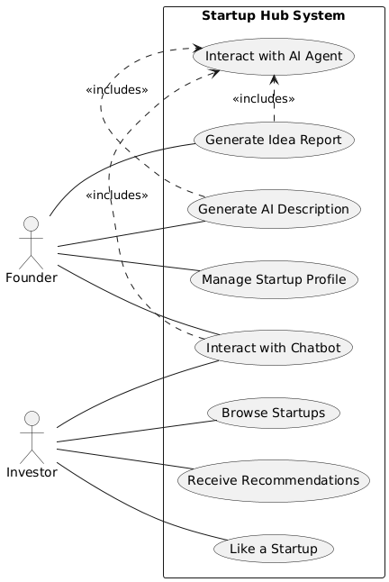
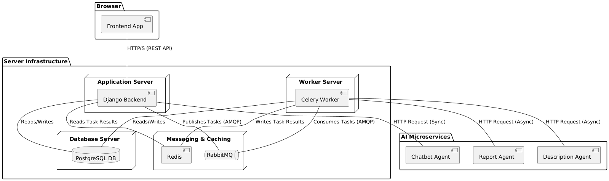
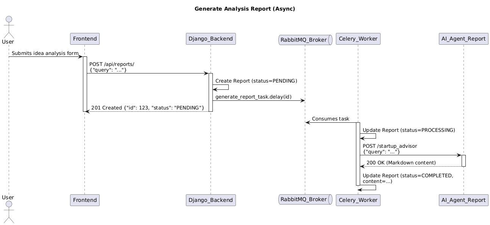
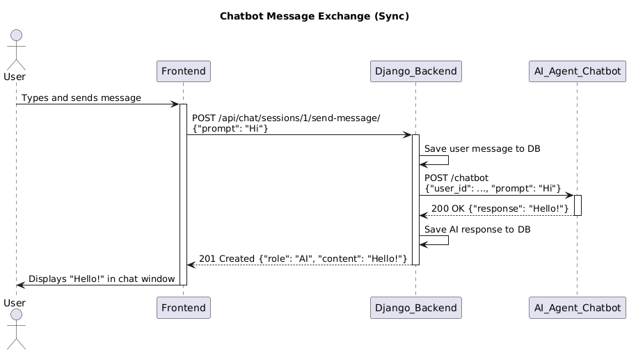

## Visual Architecture (UML Diagrams)

For a detailed visual understanding of the project's architecture, data model, and key interactions, please refer to the UML diagrams below.

### 1. Use Case Diagram
*Shows what different users can do with the system.*

### 2. Component Diagram
*A high-level view of the system's software components and their connections.*

### 3. Class Diagram (Data Model)
*A detailed look at the database schema and model relationships.*

### 4. Sequence Diagrams
*Step-by-step illustrations of key processes.*

**Asynchronous Report Generation:**

**Synchronous Chatbot Interaction:**
